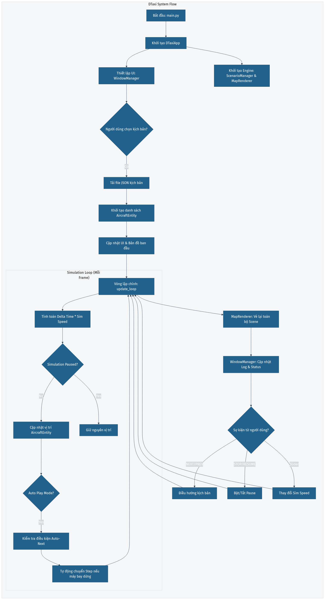
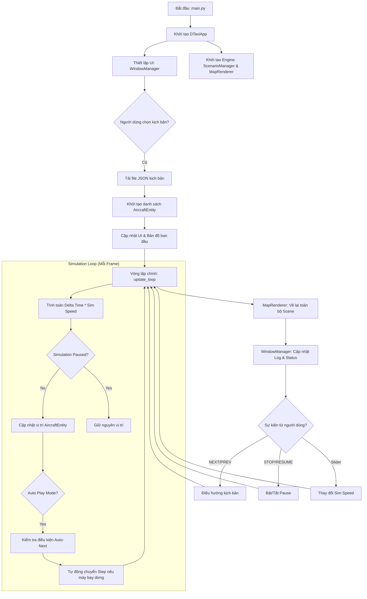

# ✈️ DTaxi - Airport Simulator v3

Chào mừng bạn đến với dự án mô phỏng di chuyển máy bay tại sân bay Tân Sơn Nhất theo chuẩn **D-TAXI**. Đây là công cụ giúp trực quan hóa lộ trình lăn (taxiing) và các bước hội thoại giữa Phi công & Kiểm soát viên không lưu.

---

## 🚀 Cách chạy chương trình

### 1. Chuẩn bị môi trường
Dự án sử dụng Python 3.12. Bạn nên tạo môi trường ảo để tránh xung đột thư viện:

```bash
# Tạo venv
python -m venv .venv

# Kích hoạt (Windows)
.venv\Scripts\activate

# Cài đặt thư viện cần thiết
pip install pygame customtkinter
```

### 2. Khởi động Simulator
Để chạy mô phỏng chính:
```bash
python src/main.py
```

### 3. Sử dụng Visual Editor (Công cụ vẽ đường lăn)
Nếu bạn muốn tự vẽ lại bản đồ hoặc tạo lộ trình mới:
```bash
python scripts/visual_editor.py
```

---

## 🎮 Hướng dẫn sử dụng

### Trong Simulator (`main.py`)
- **Chọn kịch bản**: Sử dụng menu thả xuống để chọn file kịch bản (JSON).
- **Điều khiển**: 
    - Nút **NEXT**: Chuyển sang bước tiếp theo trong hội thoại.
    - Nút **STOP/RESUME**: Tạm dừng hoặc tiếp tục di chuyển.
    - Nút **PREV**: Quay lại bước trước đó (xóa log cũ).
- **Tốc độ**: Kéo thanh trượt để tăng tốc mô phỏng lên tới **x32**.
- **Chế độ AUTO PLAY**: Tự động chạy toàn bộ kịch bản mà không cần nhấn nút.

### Trong Visual Editor (`visual_editor.py`)
- **Chuột trái**: Click để chấm các điểm (Node) tạo thành đường dẫn.
- **Phím S**: Lưu lại các đường dẫn vào file `data/paths.json`.
- **Phím R**: Xóa path đang vẽ để vẽ lại.
- **Phím D**: Xóa path cuối cùng trong danh sách.

---

## 💡 Một vài lưu ý nhỏ
- **Bản đồ**: Hệ thống hiện đang dùng file `tsn_airport_map_1.jpg`. Nếu bạn thay đổi file ảnh, hãy dùng Visual Editor để chấm lại tọa độ cho khớp.
- **Log Board**: Mọi thông điệp hội thoại đều được in ra khung bên phải với màu sắc riêng biệt (Xanh: Phi công, Xanh dương: KSV).

Chúc bạn có những giờ phút trải nghiệm mô phỏng thú vị! 🛫
---

## 🛠️ Kiến trúc vận hành (Main Flow)

Dưới đây là sơ đồ khối mô tả cách ứng dụng kết nối giữa giao diện người dùng và engine mô phỏng vật lý:





### Giải thích các thành phần chính:
1.  **DTaxiApp**: Trái tim của ứng dụng, điều phối giữa giao diện (Tkinter) và engine mô phỏng (Pygame).
2.  **update_loop**: Chạy liên tục để tính toán vật lý máy bay. Tốc độ mô phỏng (`sim_speed`) tác động trực tiếp vào `delta_time` ở đây.
3.  **ScenarioManager**: Quản lý logic kịch bản, biết được bước nào là hội thoại, bước nào là di chuyển.
4.  **MapRenderer**: Chịu trách nhiệm render hình ảnh bản đồ sân bay và các lớp đồ họa máy bay đè lên trên.
