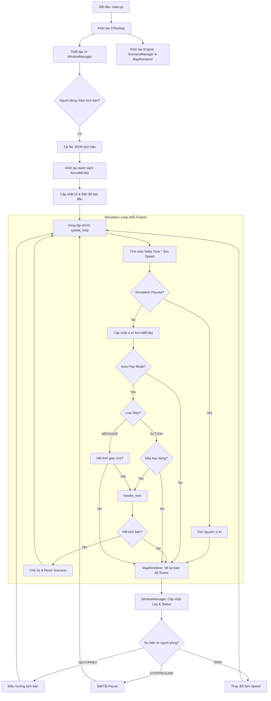

# Sơ đồ khối Luồng xử lý chính (main.py)

Tài liệu này mô tả kiến trúc vận hành của ứng dụng DTaxi Simulator.

## Giải thích các thành phần chính:
1.  **DTaxiApp**: Trái tim của ứng dụng, điều phối giữa giao diện (Tkinter) và engine mô phỏng (Pygame).
2.  **update_loop**: Chạy liên tục để tính toán vật lý máy bay. Tốc độ mô phỏng (`sim_speed`) tác động trực tiếp vào `delta_time` ở đây.
3.  **ScenarioManager**: Quản lý logic kịch bản, biết được bước nào là hội thoại, bước nào là di chuyển.
4.  **MapRenderer**: Chịu trách nhiệm render hình ảnh bản đồ sân bay và các lớp đồ họa máy bay đè lên trên.
