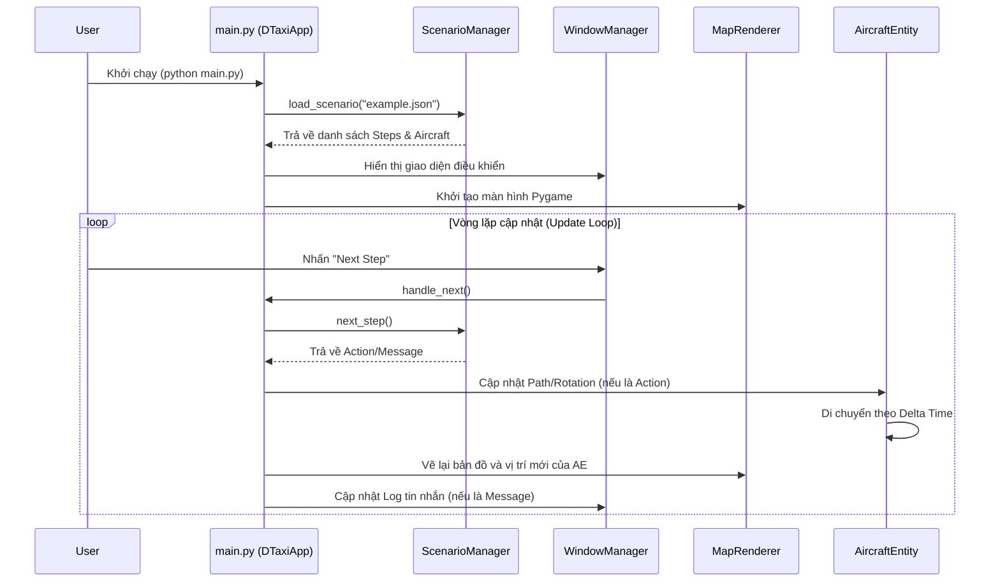

# Báo cáo Phân tích Dự án: DTaxi-airport-v3

> [!NOTE]
> Báo cáo này tổng hợp kết quả phân tích cấu trúc, công nghệ và luồng hoạt động của dự án DTaxi-airport-v3.

## 1. Kiến trúc Thư mục (Project Structure)

```text
DTaxi-airport-v3/
├── .agents/                # Cấu hình và kỹ năng của AI Agent
├── assets/                 # Tài nguyên tĩnh (Hình ảnh, v.v.)
├── data/                   # Dữ liệu cấu hình và kịch bản
│   ├── paths.json          # Định nghĩa các tọa độ đường đi (Path)
│   └── scenarios/          # Các tệp kịch bản mô phỏng (.json)
├── docs/                   # Tài liệu dự án
├── src/                    # Mã nguồn chính
│   ├── engine/             # Lõi xử lý logic kịch bản
│   │   └── scenario_manager.py
│   ├── entities/           # Các đối tượng thực thực (Aircraft)
│   │   └── aircraft_entity.py
│   ├── ui/                 # Giao diện người dùng
│   │   ├── components/     # Các thành phần UI nhỏ
│   │   ├── map_renderer.py # Vẽ bản đồ bằng Pygame
│   │   └── window_manager.py # Quản lý cửa sổ bằng CustomTkinter
│   └── main.py             # Điểm khởi chạy ứng dụng (Entry Point)
├── requirements.txt        # Các thư viện phụ thuộc (pygame, customtkinter, Pillow)
└── .venv/                  # Môi trường ảo Python
```

## 2. Công nghệ lõi (Tech Stack)

- **Ngôn ngữ**: Python 3.12+
- **Đồ họa & Mô phỏng**: `pygame` (Sử dụng để vẽ bản đồ động và máy bay).
- **Giao diện điều khiển (GUI)**: `customtkinter` (Cung cấp bảng điều khiển hiện đại, dark mode).
- **Xử lý ảnh**: `Pillow` (PIL).
- **Dữ liệu**: `JSON` (Dùng để định nghĩa kịch bản và tọa độ đường đi).

## 3. Sơ đồ tương tác (Interaction Diagram)



## 4. Phân tích chức năng chính

- **Quản lý Kịch bản (Scenario Management)**: Hỗ trợ nạp các kịch bản từ file JSON. Mỗi kịch bản gồm các "Step" nguyên tử (Atomic Steps) như tin nhắn thoại (MESSAGE) hoặc hành động di chuyển (ACTION).
- **Hệ thống Thực thể (Entity System)**: `AircraftEntity` quản lý trạng thái vị trí (x, y), góc quay (angle) và logic di chuyển mượt mà dọc theo các tọa độ định sẵn.
- **Tự động hóa (Auto Play)**: Có chế độ tự động chạy kịch bản với thời gian chờ tùy chỉnh cho tin nhắn và chờ máy bay hoàn thành hành động trước khi sang bước tiếp theo.
- **Điều hướng linh hoạt**: Cho phép đi tới (Next), quay lui (Prev) hoặc đặt lại (Reset) kịch bản bất cứ lúc nào.

## 5. Phân tích Nợ kỹ thuật (Tech Debt Audit)

- **Cấu hình cứng (Hardcoded Paths)**: Các đường dẫn như `data/scenarios` và `data/paths.json` đang được khai báo trực tiếp trong code. Nên chuyển vào file cấu hình hoặc biến môi trường.
- **Thiếu Kiểm thử (Testing)**: Chưa thấy sự hiện diện của Unit Test cho các logic quan trọng như `ScenarioManager` hay `AircraftEntity`.
- **Xử lý lỗi (Error Handling)**: Các khối `try-except` còn khá sơ sài, chủ yếu là in ra log mà chưa có cơ chế recovery mạnh mẽ.
- **Đóng gói (Packaging)**: Dự án hiện tại phụ thuộc vào việc chạy trực tiếp file script, chưa có script setup hoặc đóng gói chính thức.

## 6. Lộ trình khuyến nghị (Roadmap)

1. **Refactor**: Tách các hằng số cấu hình ra file `config.py`.
2. **Testing**: Bổ sung bộ test cho `ScenarioManager` để đảm bảo logic điều hướng steps chính xác.
3. **UI/UX**: Cải thiện MapRenderer để hỗ trợ zoom/pan nếu bản đồ sân bay lớn.
4. **Docs**: Hoàn thiện tài liệu hướng dẫn tạo kịch bản (Scenario Schema).
