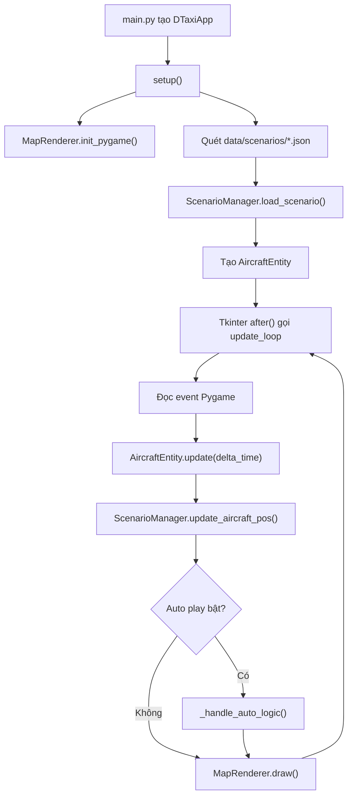

---
tags:
  - audit
  - logic-flow
  - dtaxi
aliases:
  - Audit luồng logic 2026-05-12
---

# Audit luồng logic - DTaxi Airport v3

Ngày: 2026-05-12

## Phạm vi

Báo cáo này tập trung vào luồng chạy runtime, luồng tiến/lùi step, tính nhất quán dữ liệu kịch bản, khả năng mở rộng sang nhiều máy bay, và độ khớp giữa tài liệu với code hiện tại.

## Luồng runtime hiện tại



## Nhận định tổng quan

Kiến trúc hiện tại đã tách được các vai trò chính: `WindowManager` quản lý controller/log, `ScenarioManager` quản lý kịch bản, `AircraftEntity` xử lý chuyển động, `MapRenderer` vẽ bản đồ. Vấn đề lớn nhất không nằm ở cấu trúc module, mà nằm ở tính nhất quán giữa bốn trạng thái:

- con trỏ step hiện tại,
- log hiển thị,
- trạng thái vật lý của máy bay,
- dữ liệu gốc trong scenario/path.

Khi mở rộng sang nhiều máy bay và kịch bản do visual editor sinh ra, các điểm này cần được chuẩn hóa trước.

## Cập nhật sau triển khai

Các hạng mục đã xử lý trong code:

- Đồng bộ state từng máy bay trong `update_loop()` thay vì chỉ máy bay cuối.
- Thêm snapshot `step_history` để `PREV` hoàn tác đúng một step.
- Đổi nút `STOP` thành `PAUSE`, đồng bộ `PAUSE/RESUME` khi load/reset.
- Thêm `ScenarioValidator` và script `scripts/validate_scenarios.py`.
- Visual editor gọi validator khi save scenario và sửa lỗi gán path dùng biến `ac_id` chưa khai báo.
- App ưu tiên load scenario hợp lệ đầu tiên khi khởi động, tránh mặc định vào scenario đang thiếu path.
- Bổ sung docs v3 cho scenario, docs `paths.json`, và validation rules.

Phần còn tồn ở dữ liệu:

- `example.json` và `scenario_vna123.json` vẫn thiếu path tương ứng trong `data/paths.json`.
- Đây là lỗi dữ liệu nguồn, validator đã phát hiện và runtime sẽ cảnh báo/chặn tiếp tục khi gặp action thiếu path.

Kết quả kiểm tra:

- `python -m py_compile` bằng `.venv` đã pass cho các module runtime/editor/validator.
- Test nhanh behavior `NEXT`/`PREV` bằng fake UI đã pass: `PREV` undo được MESSAGE và ACTION theo snapshot.
- Test nhanh missing path đã pass: action thiếu path tự pause và `NEXT` không bỏ qua step lỗi.
- `scripts/validate_scenarios.py` chạy đúng và trả lỗi cho 2 scenario cũ thiếu path; `scenario_full_takeoff.json` hợp lệ.

## Phát hiện

### F1 - State nhiều máy bay hiện chỉ lưu đúng máy bay cuối cùng

Mức độ: Cao

Trong `src/main.py`, `update_loop()` gọi `entity.update(delta_time)` cho tất cả máy bay, nhưng `scenario_manager.update_aircraft_pos()` lại nằm sau vòng lặp. Biến `entity` lúc đó chỉ còn trỏ tới máy bay cuối cùng trong `self.aircraft_entities`.

Tác động:

- Khi có nhiều máy bay, `ScenarioManager.aircraft_states` sẽ sai cho mọi máy bay trừ máy bay cuối.
- Các logic tương lai như conflict detection, position report, replay, reset nâng cao, hoặc điều phối song song sẽ không đáng tin.

Đề xuất:

- Đưa `update_aircraft_pos()` vào trong vòng lặp từng entity.
- Đồng bộ cả `angle` nếu `aircraft_states` được dùng làm nguồn trạng thái logic.

Trạng thái: Đã sửa bằng `_sync_aircraft_state()` và gọi trong từng vòng lặp entity.

### F2 - Nhiều scenario đang tham chiếu path không tồn tại

Mức độ: Cao

`data/paths.json` hiện chỉ có `fullPathTakeOff` và `1`.

Các tham chiếu lỗi:

- `data/scenarios/example.json`: `beforeE4`, `E4`, `25L`
- `data/scenarios/scenario_vna123.json`: `taxiway_A`, `taxiway_B`, `taxiway_C`, `rwy_25L_entry`, `rwy_25L_takeoff`

Tác động:

- App vẫn ghi log “moving via ...” dù không có path.
- Auto play có thể xem action đó như đã xong vì không máy bay nào thật sự di chuyển.
- Demo dễ tạo cảm giác scenario chạy đúng trong khi phần mô phỏng vật lý đã bị bỏ qua.

Đề xuất:

- Validate scenario trước khi cho chọn/chạy.
- Nếu thiếu path, hiển thị lỗi rõ ràng và không coi action là hoàn tất.
- Visual editor trong tương lai nên sinh scenario và path như một bộ dữ liệu nhất quán.

Trạng thái: Đã thêm validator và runtime warning. Dữ liệu path bị thiếu vẫn cần được bổ sung bằng visual editor hoặc chỉnh file JSON.

### F3 - Tài liệu schema đã lỗi thời so với code

Mức độ: Trung bình

Tài liệu cũ mô tả step dạng gộp `messages` và `path` trong một object. Code hiện tại dùng mô hình Atomic Events:

- `MESSAGE`: `sender`, `target`, `text`, `timestamp`
- `ACTION`: `action`, `aircraft`, `path_name`, `speed`, `report_text`

Đã cập nhật:

- `docs/antigravity/040-Data-Specs/Scenario-JSON-Schema.md` đã được chuyển sang v3 Atomic Events.
- Bản v2 cũ được lưu tại `docs/antigravity/040-Data-Specs/archive/Scenario-JSON-Schema-v2-legacy.md`.

Trạng thái: Đã sửa.

### F4 - PREV nên tiếp tục là “hoàn tác một step”, nhưng cần lưu đủ trạng thái trước step

Mức độ: Trung bình

Bạn muốn giữ đúng triết lý `PREV = undo một step`, không phải chỉ undo action. Hướng này hợp lý, nhất là khi người dùng chỉnh/tua scenario trong visual editor.

Vấn đề hiện tại là `handle_prev()` đang hoàn tác theo logic suy đoán từ step hiện tại:

- Với `MESSAGE`, chỉ xóa log.
- Với `MOVE_ALONG_PATH`, teleport về `path_coords[0]`.

Cách này chưa đủ chắc vì `path_coords[0]` không luôn bằng vị trí máy bay trước action, đặc biệt khi visual editor sinh path nối từ nhiều nguồn, hoặc khi có nhiều máy bay.

Đề xuất đúng với yêu cầu:

- Trước khi apply mỗi step, lưu một snapshot nhỏ vào `step_history`.
- Snapshot gồm: `current_step_index`, log state hoặc log entry id, trạng thái từng aircraft (`x`, `y`, `angle`, `is_moving`, `target_path`, `current_speed`).
- Khi bấm `PREV`, pop snapshot cuối và restore lại đúng trạng thái trước step đó.
- Như vậy `PREV` vẫn hoàn tác một step bất kỳ: message thì mất đúng một dòng log, action thì máy bay quay về đúng trạng thái trước action, rotate thì góc quay quay lại đúng giá trị cũ.

Trạng thái: Đã triển khai bằng `step_history` snapshot.

### F5 - Semantic `NEXT` đã được chốt: hoàn tất action hoặc bắt đầu step kế tiếp

Mức độ: Trung bình

Tôi dùng từ “advance” với nghĩa là “chuyển sang step kế tiếp”.

Quyết định sản phẩm:

- Nếu đang thực hiện `ACTION`, bấm `NEXT` sẽ hoàn tất action hiện tại.
- Nếu không có action đang chạy, bấm `NEXT` sẽ chuyển sang và bắt đầu thực hiện step kế tiếp.

Code hiện tại về cơ bản đã theo hướng này:

- `handle_next()` kiểm tra action đang moving trước.
- Nếu có aircraft đang moving, gọi `complete_path()` và dừng tại step hiện tại.
- Nếu không còn movement, gọi `scenario_manager.next_step()` và `_apply_step()`.

Điểm cần làm rõ:

- UI có thể giữ nhãn `NEXT`, nhưng tài liệu hướng dẫn cần ghi rõ nút này có hành vi theo ngữ cảnh.
- Nếu muốn trực quan hơn, có thể đổi text động sang `COMPLETE` khi action đang chạy và quay lại `NEXT` khi đứng yên.

### F5.1 - Nút pause/resume cần đồng bộ nhãn với trạng thái thật

Mức độ: Thấp

Lỗi quan sát được:

- UI dùng nhãn `STOP` dù logic thật là tạm dừng/tiếp tục.
- Khi reset hoặc đổi scenario, `ScenarioManager.is_paused` được reset về `False`, nhưng nút có thể vẫn đang hiển thị trạng thái cũ nếu trước đó đang pause.

Đã sửa:

- Nút điều khiển dùng nhãn `PAUSE` khi simulator đang chạy.
- Nút đổi sang `RESUME` khi simulator đang pause.
- Khi load scenario hoặc reset scenario, UI ép nút về `PAUSE` để khớp `is_paused = False`.

Trạng thái: Đã sửa.

### F6 - Thiếu cơ chế validate dữ liệu cho kịch bản sinh từ editor

Mức độ: Trung bình

Khi visual editor trở thành nguồn tạo scenario, cần validate dữ liệu ở ranh giới lưu/chạy:

- `aircraft` trong action phải tồn tại trong `aircraft_list`.
- `path_name` phải tồn tại trong `paths.json`.
- Step id không được trùng.
- Với nhiều máy bay, không nên có hai action cùng điều khiển một máy bay ở cùng thời điểm nếu schema chưa hỗ trợ song song.
- Path nên có ít nhất 2 điểm, trừ khi đó là action đặc biệt.

Đề xuất:

- Tạo `ScenarioValidator` riêng thay vì để lỗi rải trong `ScenarioManager`.
- Visual editor gọi validator trước khi save.
- Simulator gọi validator trước khi load.

### F7 - Ghi chú môi trường Python

Mức độ: Thấp

Trong PowerShell sandbox, `python` và `py` không chạy được. Bạn cho biết trong bash vẫn activate được bằng:

```bash
source /d/Backup_Nguyen/Workspaces/Giao/DTaxi-airport-v3/.venv/Scripts/activate
```

Tôi đã thử gọi bash từ sandbox nhưng bị lỗi quyền truy cập `E_ACCESSDENIED`, nên chưa xác nhận runtime bằng bash trong lượt này.

Gợi ý thực dụng:

- Nếu bạn chạy app bằng bash được thì không nhất thiết phải sửa `py`.
- Để PowerShell dùng được, cần thêm Python vào PATH hoặc recreate `.venv` từ một interpreter Windows còn tồn tại.
- Với workflow hiện tại, có thể ghi README rõ: “Chạy bằng Git Bash/MSYS bash và activate `.venv` theo đường dẫn `/d/...`”.

## Đề xuất cấu trúc tài liệu

Nên giữ cấu trúc hiện tại nhưng chuẩn hóa ý nghĩa từng nhóm:

```text
docs/
  antigravity/
    010-Planning/
      Roadmap.md
    020-Requirements/
      PRD.md
      Scenarios.md
    030-Design/
      SDD.md
      Execution-Flow.md
      Multi-Aircraft-Flow.md
      Visual-Editor-Flow.md
    040-Data-Specs/
      Scenario-JSON-Schema.md
      Paths-JSON-Schema.md
      Validation-Rules.md
      archive/
        Scenario-JSON-Schema-v2-legacy.md
    050-User-Guides/
      Operation-Walkthrough.md
      Coordinate-Mapping-Guide.md
      Visual-Editor-Guide.md
  040-Diagrams/
    Main_Flow.md
  050-Research/
    Logic-Flow-Audit-2026-05-12.md
```

Nguyên tắc:

- `040-Data-Specs` là nguồn sự thật cho file JSON mà app/editor đọc ghi.
- `030-Design` mô tả luồng xử lý và quyết định thiết kế.
- `050-Research` chứa audit, phân tích, phát hiện theo ngày.
- `archive` chỉ chứa tài liệu lịch sử, không phải hướng dẫn hiện hành.

## Ưu tiên tiếp theo

1. Sửa sync state nhiều máy bay trong `update_loop()`.
2. Thiết kế `step_history` để `PREV` hoàn tác đúng một step bằng snapshot.
3. Thêm `ScenarioValidator` dùng chung cho simulator và visual editor.
4. Bổ sung `Paths-JSON-Schema.md` và `Validation-Rules.md`.
5. Chọn rõ semantic cho nút `NEXT`: “hoàn tất action hiện tại” hay “chuyển sang step tiếp theo”.
