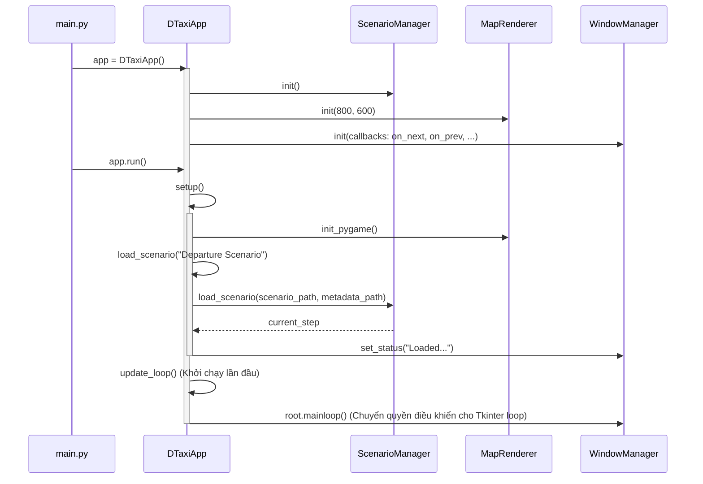
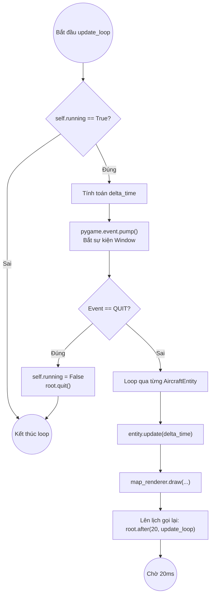
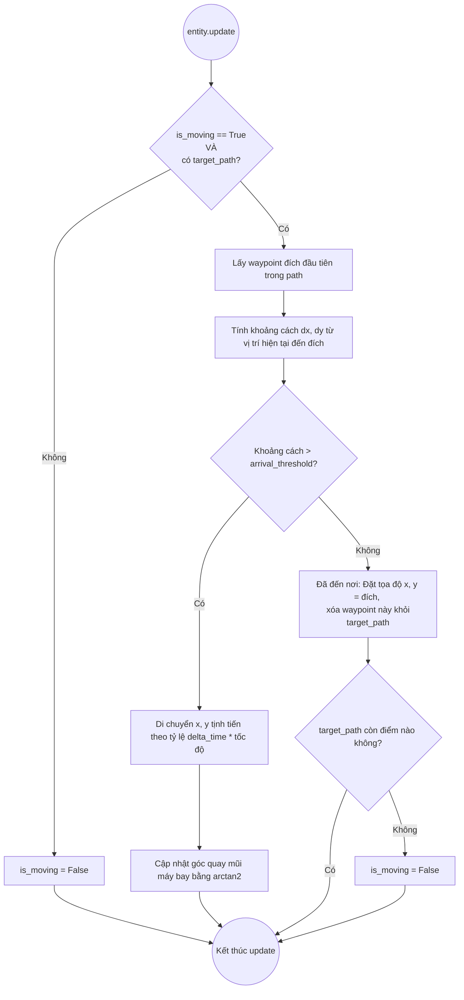
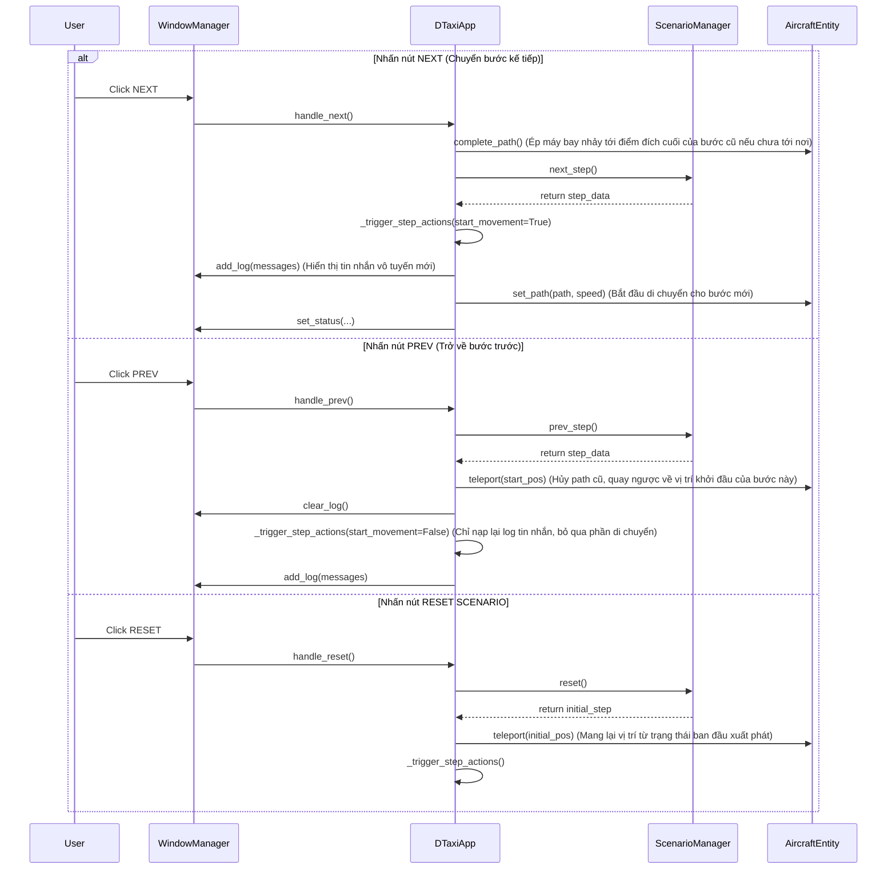

# Phân tích Luồng thực thi (Execution Flow) DTaxiApp

Tài liệu này mô tả chi tiết luồng chạy của ứng dụng mô phỏng DTaxi-airport-v3, từ quá trình khởi tạo, vòng lặp chính, cho tới các luồng sự kiện tương tác của người dùng.

## 1. Khởi tạo và Thiết lập (Initialization & Setup)

Ứng dụng khởi chạy bắt đầu từ `main.py`, tạo đối tượng `DTaxiApp` và gọi phương thức `run()`.

## 2. Vòng lặp Chính (Main Update Loop)

Vòng lặp chính được điều khiển qua cơ chế ngắt nhịp `after()` của đối tượng Tkinter trong WindowManager, giúp kết hợp an toàn cả hai framework UI (Tkinter cho bảng điều khiển, và Pygame cho bản đồ).

## 3. Luồng Cập nhật Thực thể Máy bay (Aircraft Entity Update)

Giai đoạn cập nhật logic di chuyển vật lý của từng máy bay trong mỗi frame.

## 4. Luồng Xử lý Điều khiển của Người dùng (Scenario Controls)

Hành vi ứng dụng khi người dùng tương tác với Controller của AeroMACS (NEXT, PREV, RESET).

